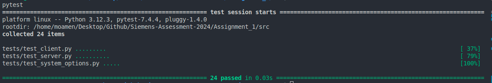
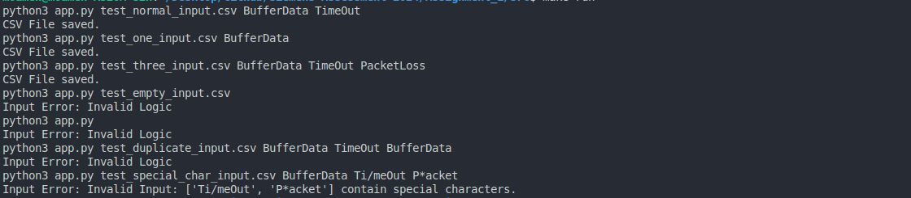

# How to Run the Program

## Build
> [!Note]  
> This setup guide assumes that you are in the `Siemens-Assessment-2024` directory.

#### 1. Go to the Assignment 1 src Folder
```
cd ./Assignment_1/src
```

#### 2. Download pytest for testing

##### windows
```
pip install -r requirements.txt
```

##### linux
```
sudo apt install python3-pytest
```

## Run

#### 1. Run Tests
##### windows
```
mingw32-make test
```

##### linux
```
make test
```



#### 2. Run the Main Program with multiple input

> [!Note]  
> For custom input run
> ```
> python3 app.py [csv_file_name] [option1] [option2] [...]
> ```  
>  or edit the Makefile ARGS

##### windows
```
mingw32-make run
```

##### linux
```
make run
```

  
  

> [!Note]  
> use `make all` to run and test.